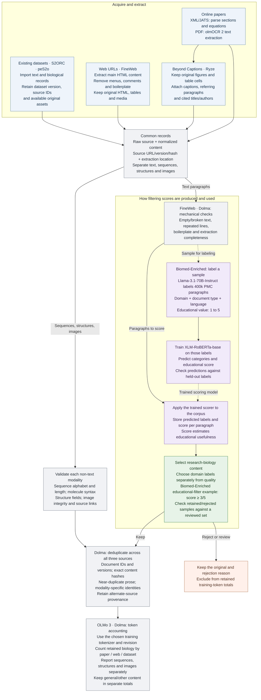

# Processing recipe for biological training data

[Model and dataset comparison](README.md)

## Processing diagram

```mermaid
flowchart TB
    subgraph INPUTS["Acquire and extract"]
        direction LR
        PAPER["Online papers<br/>XML/JATS: parse sections and equations<br/>PDF: olmOCR 2 text extraction"]
        ASSETS["Beyond Captions · Ryze<br/>Keep original figures and table cells<br/>Attach captions, referring paragraphs<br/>and cited titles/authors"]
        WEB["Web URLs · FineWeb<br/>Extract main HTML content<br/>Remove menus, comments and boilerplate<br/>Keep original HTML, tables and media"]
        DATA["Existing datasets · S2ORC · peS2o<br/>Import text and biological records<br/>Retain dataset version, source IDs<br/>and available original assets"]
        PAPER --> ASSETS
    end

    PAPER --> RECORDS
    ASSETS --> RECORDS
    WEB --> RECORDS
    DATA --> RECORDS
    RECORDS["Common records<br/>Raw source + normalized content<br/>Source URL/version/hash + extraction location<br/>Separate text, sequences, structures and images"]

    RECORDS -->|Text paragraphs| CHECKS
    RECORDS -->|Sequences, structures, images| MODALITY

    subgraph FILTER["How filtering scores are produced and used"]
        direction TB
        CHECKS["FineWeb · Dolma: mechanical checks<br/>Empty/broken text, repeated lines,<br/>boilerplate and extraction completeness"]
        TEACHER["Biomed-Enriched: label a sample<br/>Llama-3.1-70B-Instruct labels 400k PMC paragraphs<br/>Domain + document type + language<br/>Educational value: 1 to 5"]
        TRAIN["Train XLM-RoBERTa-base on those labels<br/>Predict categories and educational score<br/>Check predictions against held-out labels"]
        SCORES["Apply the trained scorer to the corpus<br/>Store predicted labels and score per paragraph<br/>Score estimates educational usefulness"]
        SELECT["Select research-biology content<br/>Choose domain labels separately from quality<br/>Biomed-Enriched educational-filter example: score ≥ 3/5<br/>Check retained/rejected samples against a reviewed set"]
        CHECKS -.->|Sample for labeling| TEACHER
        TEACHER --> TRAIN
        TRAIN -.->|Trained scoring model| SCORES
        CHECKS -->|Paragraphs to score| SCORES
        SCORES --> SELECT
    end

    MODALITY["Validate each non-text modality<br/>Sequence alphabet and length; molecule syntax<br/>Structure fields; image integrity and source links"]
    SELECT -->|Keep| DEDUP
    SELECT -->|Reject or review| REJECT["Keep the original and rejection reason<br/>Exclude from retained training-token totals"]
    MODALITY --> DEDUP
    DEDUP["Dolma: deduplicate across all three sources<br/>Document IDs and versions; exact content hashes<br/>Near-duplicate prose; modality-specific identities<br/>Retain alternate-source provenance"]
    DEDUP --> TOKENS["OLMo 3 · Dolma: token accounting<br/>Use the chosen training tokenizer and revision<br/>Count retained biology by paper / web / dataset<br/>Report sequences, structures and images separately<br/>Keep general/other content in separate totals"]

    classDef source fill:#eef4fb,stroke:#688aaa,color:#17324d
    classDef record fill:#f1f2f5,stroke:#78818c,color:#252d36
    classDef scoring fill:#f1eafa,stroke:#8a67ae,color:#36244b
    classDef selection fill:#e7f3e8,stroke:#43884a,color:#173b1d
    classDef rejected fill:#fff0ea,stroke:#b57956,color:#593323
    class PAPER,ASSETS,WEB,DATA source
    class RECORDS,CHECKS,MODALITY,DEDUP,TOKENS record
    class TEACHER,TRAIN,SCORES scoring
    class SELECT selection
    class REJECT rejected

    click PAPER "https://arxiv.org/abs/2510.19817" "olmOCR 2"
    click ASSETS "https://arxiv.org/html/2606.01049v2" "Beyond Captions"
    click WEB "https://arxiv.org/html/2406.17557v1" "FineWeb"
    click DATA "https://aclanthology.org/2020.acl-main.447/" "S2ORC"
    click TEACHER "https://arxiv.org/html/2506.20331v1" "Biomed-Enriched"
    click DEDUP "https://arxiv.org/html/2402.00159v1" "Dolma"
    click TOKENS "https://arxiv.org/html/2512.13961v2" "OLMo 3"
```
